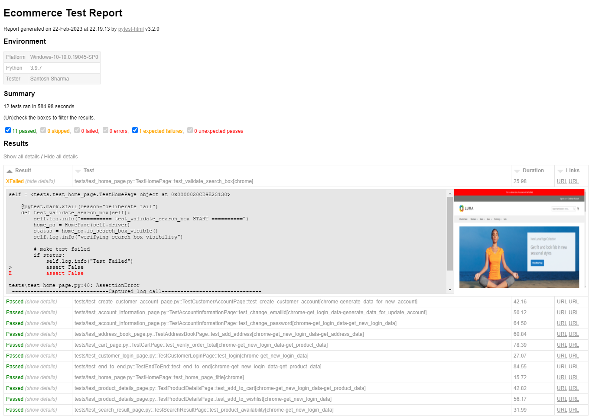
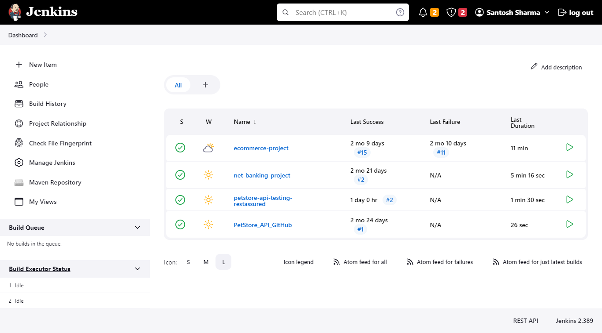

# ECOMMERCE AUTOMATION PROJECT
This repository contains codes to automate test cases.

## PROJECT DETAILS:-
Web based application that allows customers to browse and purchase items from an online store.

## WEBSITE LINK :-
#### This website is open source.
Link :- https://magento.softwaretestingboard.com/

## APPROACH:-
* Developed data driven hybrid framework.
* Created and executed test cases using selenium(Webdriver) and Pytest libraries.
* Generated HTMLreport.

## TEST REPORT SCREENSHOTS :-

### Jenkins

## TECHNOLOGY USED :-
* Python
* Selenium(Webdriver)
* Pytest
* HTML Report